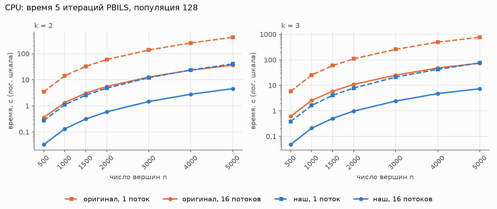
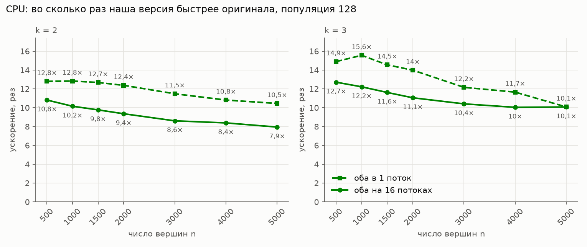
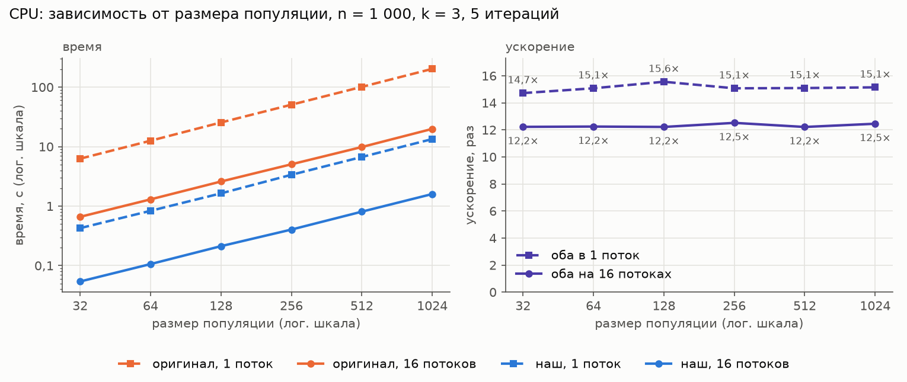
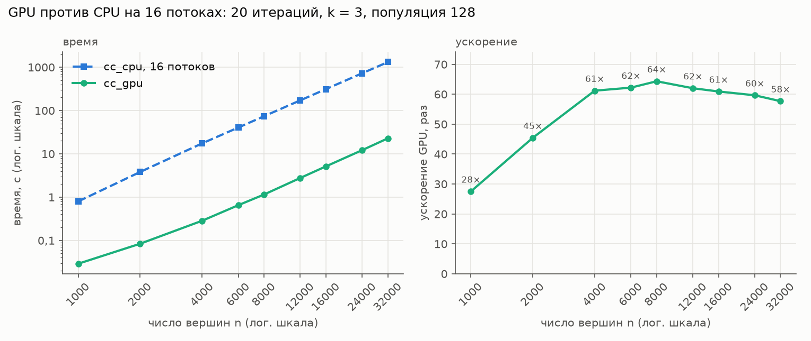
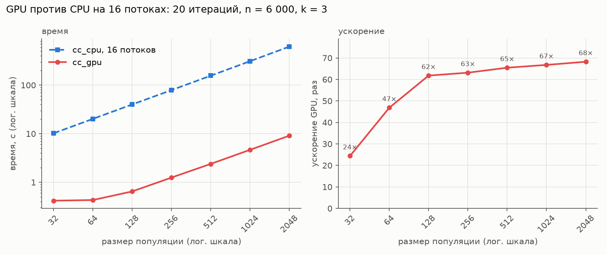
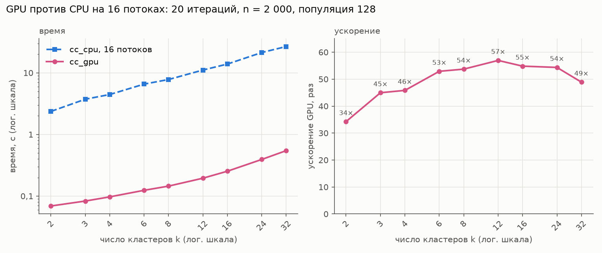
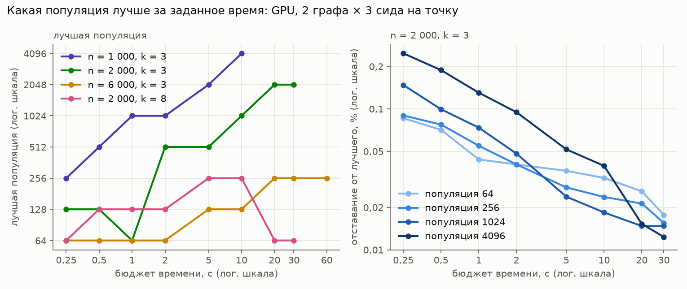

# Замеры производительности

Стенд: Ryzen 7 3700X (8 ядер / 16 потоков), RTX 4070 Ti SUPER (Ada, 66 SM, 48 МБ L2),
Windows 11, MSVC 19.44 (`/O2 /arch:AVX2`), CUDA 13.3 (`sm_89`). Инстансы: G(n, p) при
p = 0,33, `--graph-seed 7`. Исходные числа лежат в `docs/data/*.csv`. Графики и таблицы
перестраивает `python docs/plot_benchmarks.py docs/data docs/img --tables`.

PBILS везде идёт с параметрами оригинала: турнир 5, вероятность возмущения 0,4, популяция 128,
если в разделе не сказано иное. Мы фиксируем число итераций и отключаем ранний останов, чтобы
момент последнего рекорда не влиял на время. В таблицах стоят медианы по прогонам.

## 1. CPU: наша версия против оригинала

### Быстрый пересчёт целевой функции

Целевая функция считает разногласия, и её можно записать без перебора пар:

```
f = m + Σ_c C(n_c, 2) − 2·W
```

где m означает число рёбер, n_c размер кластера c, W число рёбер внутри кластеров. W и оценку
хода даёт матрица G = A·Z, в которой G[v][c] равно числу соседей вершины v в кластере c.
Перенос вершины v из кластера a в кластер c меняет f на

```
Δf = (n_c − n_a + 1) − 2·(G[v][c] − G[v][a])
```

Оценка хода стоит O(1). Применённый ход правит две строки G, и в них только соседей v.

Оригинал тоже держит кэш выигрышей, но строит его заново в начале каждого локального поиска
и выбрасывает в конце. Остальные шаги итерации он на каждой особи считает по парам вершин:

| Шаг итерации              | Оригинал                                                        | Наша версия                                                            |
|---------------------------|-----------------------------------------------------------------|------------------------------------------------------------------------|
| начало локального поиска  | строит кэш с нуля, n² проверок пар                              | G приходит вместе с особью из селекции, пересчёта нет                  |
| f после локального поиска | `GetDistanceToGraph`, n²/2 проверок пар                         | уже известна: f += Δf на каждом ходе                                   |
| возмущение                | при k = 3 проход по строке каждой затронутой вершины, 0,4·n² пар | меняем метки, затем один `Rebuild` G: k·n²/32 слов через popcount      |
| f после возмущения        | снова `GetDistanceToGraph`, n²/2                                | по формуле выше, W `Rebuild` накапливает попутно за O(n)               |
| строка A·Z                | по одной паре: виртуальный вызов и `vector<vector<bool>>`       | побитово: `popcount(строка A & маска кластера)`, 32 пары за инструкцию |

Сам спуск у обеих версий стоит одинаково: O(k·n) на поиск лучшего хода и O(n) на его
применение. Время мы выигрываем на шагах вокруг спуска и на побитовой арифметике.

### Протокол

Оригинал ([BIGADIL/graph_correlation_clustering](https://github.com/BIGADIL/graph_correlation_clustering))
мы собрали из неизменённых исходников вне этого репозитория, теми же флагами MSVC плюс
`/std:c++20`. Небольшой драйвер читает граф, сохранённый `cc_cpu --save-graph`, и вызывает
его `IPLSAlgorithm` из версии для k = 2 или k = 3 с ранним остановом больше числа итераций.
Время драйвер берёт из `steady_clock` вокруг `Train()`, потому что штатная обвязка оригинала
округляет его до секунд.

Каждая точка: 5 итераций, 5 прогонов. Оригинал сидится от `random_device`, наши прогоны идут с
сидами 5–9. Прогоны обычно расходятся на единицы процентов, в худшей точке на 20 %, и медиана
такие выбросы гасит.

При k = 2 обе версии выполняют один и тот же алгоритм: возмущение в 2CC-версии оригинала
переворачивает метку, как у нас. При k = 3 оригинал возмущает жадно, отправляя вершину в
лучший для неё кластер, а мы в случайный. Там версии проходят разные траектории, и мы
сравниваем время при одинаковых параметрах, а не одинаковую работу. По качеству версии не
различаются ни при каком k: медианы f расходятся не больше чем на 0,02 %.

### Размер графа



k = 2:

| n     | оригинал, 1 поток | оригинал, 16 потоков | наш, 1 поток | наш, 16 потоков |
|-------|------------------:|---------------------:|-------------:|----------------:|
| 500   |            3,48 с |              0,357 с |      0,272 с |         0,033 с |
| 1 000 |            14,1 с |               1,34 с |       1,10 с |         0,132 с |
| 1 500 |            32,6 с |               3,07 с |       2,58 с |         0,314 с |
| 2 000 |            59,3 с |               5,55 с |       4,79 с |         0,593 с |
| 3 000 |             138 с |               12,7 с |       12,0 с |          1,47 с |
| 4 000 |             256 с |               23,4 с |       23,7 с |          2,79 с |
| 5 000 |             423 с |               36,3 с |       40,5 с |          4,58 с |

k = 3:

| n     | оригинал, 1 поток | оригинал, 16 потоков | наш, 1 поток | наш, 16 потоков |
|-------|------------------:|---------------------:|-------------:|----------------:|
| 500   |            5,79 с |               0,61 с |      0,389 с |         0,048 с |
| 1 000 |            25,5 с |               2,59 с |       1,64 с |         0,212 с |
| 1 500 |            59,7 с |               5,89 с |       4,11 с |         0,507 с |
| 2 000 |             110 с |               10,9 с |       7,86 с |         0,989 с |
| 3 000 |             257 с |               25,2 с |       21,2 с |          2,42 с |
| 4 000 |             495 с |               48,1 с |       42,4 с |          4,79 с |
| 5 000 |             765 с |               74,2 с |       75,9 с |          7,37 с |



* При k = 2, где алгоритм одинаковый, наша версия обгоняет оригинал в 10,5–12,8 раза в один
  поток и в 7,9–10,8 раза на 16 потоках. При k = 3: в 10,1–15,6 и 10,0–12,7 раза.
* С ростом n отрыв сокращается. Время нашей версии растёт с n чуть быстрее, чем у оригинала,
  и при n = 5 000 наш вариант в один поток догоняет оригинал на 16 потоках (0,90–0,98×). При
  n = 500 он был быстрее его в 1,3–1,6 раза.
* От 16 потоков оригинал ускоряется в 9,5–11,6 раза, наша версия в 7,7–10,3 раза. Вероятно, у
  нас на особь приходится меньше работы, и синхронизация между фазами итерации съедает большую
  её долю. Поэтому на 16 потоках отрыв меньше, чем в один поток.

### Размер популяции



n = 1 000, k = 3:

| популяция | оригинал, 1 поток | оригинал, 16 потоков | наш, 1 поток | наш, 16 потоков |
|----------:|------------------:|---------------------:|-------------:|----------------:|
|        32 |            6,27 с |               0,66 с |      0,426 с |         0,054 с |
|        64 |            12,6 с |                1,3 с |      0,833 с |         0,106 с |
|       128 |            25,5 с |               2,59 с |       1,64 с |         0,212 с |
|       256 |            50,6 с |               5,04 с |       3,36 с |         0,403 с |
|       512 |             101 с |               9,84 с |       6,69 с |         0,806 с |
|     1 024 |             203 с |               19,9 с |       13,4 с |          1,59 с |

Время всех четырёх вариантов пропорционально популяции, и отношение от неё не зависит:
14,7–15,6× в один поток и 12,2–12,5× на 16 потоках.

## 2. GPU против CPU на 16 потоках

### Протокол

* GPU: `--ls-kernel global`. Во время локального поиска решение (G, метки) лежит в
  глобальной памяти. Хост не запрашивает под ядро динамическую разделяемую память, и пропорцию
  между L1 и разделяемой памятью выбирает драйвер. В ядре остаются статические буферы под
  редукцию лучшего хода и размеры кластеров, 640 или 768 байт на блок.
* На ход ядро делает один барьер. Блок в 256 потоков оно берёт при популяции от 256 и
  k·n < 10 000, в остальных случаях 512. Это правило мы сняли калибровкой на этой карте.
* CPU: `cc_cpu --threads 16`, все 16 аппаратных потоков.
* Обе стороны: `--iters 20 --early-stop 1000`. У GPU четыре прогона с сидами 5–8, первый мы
  отбрасываем: в него попадает создание контекста CUDA. CPU идёт с сидами 6–8. При одинаковом
  сиде CPU и GPU проходят одну траекторию, так что работа одинаковая. Значение f у GPU и CPU
  совпало во всех прогонах.
* Базовая точка: k = 3, популяция 128. Каждая серия меняет один параметр.
* В типичной точке прогоны расходятся на 0,6 %, в 90 % точек меньше чем на 2 %, так что
  разница в пару процентов между соседними точками остаётся шумом.

### 2.1. Размер графа



k = 3, популяция 128:

| n      | `cc_gpu` | `cc_cpu --threads 16` | GPU / CPU |
|--------|---------:|----------------------:|----------:|
| 1 000  |  0,029 с |               0,798 с |       28× |
| 2 000  |  0,084 с |                3,82 с |       45× |
| 4 000  |  0,285 с |                17,4 с |       61× |
| 6 000  |  0,652 с |                40,6 с |       62× |
| 8 000  |   1,15 с |                73,9 с |       64× |
| 12 000 |   2,77 с |                 172 с |       62× |
| 16 000 |   5,14 с |                 313 с |       61× |
| 24 000 |   12,2 с |                 727 с |       60× |
| 32 000 |   22,8 с |               1 320 с |       58× |

Ускорение растёт с 28× при n = 1 000 до 61–64× при n от 4 000 до 16 000 и медленно спадает до
58× к n = 32 000, верхней границе 16-битных счётчиков G. На маленьком графе 128 особей не
загружают карту: работы на ход мало, и время съедают задержки.

### 2.2. Размер популяции



n = 6 000, k = 3:

| популяция | `cc_gpu` | `cc_cpu --threads 16` | GPU / CPU |
|----------:|---------:|----------------------:|----------:|
|        32 |  0,418 с |                10,2 с |       24× |
|        64 |  0,431 с |                20,2 с |       47× |
|       128 |  0,648 с |                40,0 с |       62× |
|       256 |   1,25 с |                78,9 с |       63× |
|       512 |   2,39 с |                 157 с |       65× |
|     1 024 |   4,66 с |                 311 с |       67× |
|     2 048 |   9,11 с |                 622 с |       68× |

Время CPU пропорционально популяции. GPU считает 32 и 64 особи за одно и то же время: 64 блока
не занимают 66 SM, и половина карты простаивает. С популяции 256 время GPU тоже растёт линейно,
и ускорение выходит на 63–68×.

### 2.3. Число кластеров



n = 2 000, популяция 128:

| k  | `cc_gpu` | `cc_cpu --threads 16` | GPU / CPU |
|---:|---------:|----------------------:|----------:|
|  2 |  0,069 с |                2,36 с |       34× |
|  3 |  0,083 с |                3,73 с |       45× |
|  4 |  0,097 с |                4,45 с |       46× |
|  6 |  0,124 с |                6,56 с |       53× |
|  8 |  0,145 с |                7,79 с |       54× |
| 12 |  0,195 с |                11,1 с |       57× |
| 16 |  0,253 с |                13,9 с |       55× |
| 24 |  0,393 с |                21,4 с |       54× |
| 32 |  0,546 с |                26,7 с |       49× |

При k = 2 GPU получает меньше всего работы на ход, и ускорение самое низкое, 34×. От k = 3 до
k = 32 оно держится на 45–57×. От k = 2 до k = 32 время CPU растёт в 11,3 раза, время GPU в
7,9 раза.

## 3. Какая популяция лучше за заданное время

Чем больше особей, тем шире поиск за итерацию и тем меньше итераций за то же время. Мы проверили, какая
популяция даёт лучшее решение к заданному моменту.

### Протокол

* GPU, `--ls-kernel global`, популяции 64–4 096. Для каждой популяции один длинный прогон
  `--iters 1000000 --early-stop 1000000 --time-limit T --verbose`: он печатает рекорд после каждой
  итерации, и из него берётся рекорд к любому бюджету до T. T равно 10 с при n = 1 000, 30 с при
  n = 2 000 и 60 с при n = 6 000.
* Два графа (`--graph-seed` 7 и 8) и три сида на каждом. Первый прогон процесса мы отбрасываем
  из-за создания контекста CUDA.
* Качество мы меряем отставанием от лучшего решения, которое на этом графе нашла любая
  популяция, и берём медиану по шести прогонам. Данные лежат в `docs/data/popopt.csv`.

### Результат



Медианное отставание от лучшего известного решения, %, лучшая популяция выделена. Прочерк стоит
там, где крупная популяция не успела закончить первую итерацию.

n = 1 000, k = 3:

| бюджет | 64    | 128   | 256       | 512       | 1 024     | 2 048     | 4 096     |
|-------:|------:|------:|----------:|----------:|----------:|----------:|----------:|
| 0,25 с | 0,065 | 0,077 | **0,057** | 0,059     | 0,072     | 0,121     | 0,166     |
|  0,5 с | 0,058 | 0,047 | 0,051     | **0,043** | 0,044     | 0,054     | 0,117     |
|    1 с | 0,05  | 0,038 | 0,035     | 0,029     | **0,023** | 0,03      | 0,055     |
|    2 с | 0,033 | 0,028 | 0,03      | 0,024     | **0,022** | 0,023     | 0,039     |
|    5 с | 0,026 | 0,027 | 0,012     | 0,017     | 0,018     | **0,012** | 0,016     |
|   10 с | 0,025 | 0,018 | 0,009     | 0,011     | 0,013     | 0,008     | **0,008** |

n = 2 000, k = 3:

| бюджет | 64        | 128       | 256   | 512       | 1 024     | 2 048     | 4 096 |
|-------:|----------:|----------:|------:|----------:|----------:|----------:|------:|
| 0,25 с | 0,086     | **0,083** | 0,09  | 0,111     | 0,148     | 0,195     | 0,248 |
|  0,5 с | 0,071     | **0,063** | 0,077 | 0,082     | 0,099     | 0,138     | 0,188 |
|    1 с | **0,044** | 0,045     | 0,055 | 0,053     | 0,074     | 0,101     | 0,13  |
|    2 с | 0,04      | 0,043     | 0,04  | **0,039** | 0,048     | 0,065     | 0,095 |
|    5 с | 0,036     | 0,031     | 0,028 | **0,021** | 0,024     | 0,026     | 0,052 |
|   10 с | 0,032     | 0,025     | 0,024 | 0,021     | **0,018** | 0,021     | 0,039 |
|   20 с | 0,026     | 0,015     | 0,021 | 0,016     | 0,015     | **0,01**  | 0,015 |
|   30 с | 0,018     | 0,011     | 0,016 | 0,014     | 0,015     | **0,006** | 0,012 |

n = 6 000, k = 3:

| бюджет | 64        | 128       | 256       | 512   | 1 024 | 2 048 | 4 096 |
|-------:|----------:|----------:|----------:|------:|------:|------:|------:|
| 0,25 с | **0,087** | 0,099     | 0,13      | 0,169 | —     | —     | —     |
|  0,5 с | **0,064** | 0,073     | 0,093     | 0,121 | 0,164 | —     | —     |
|    1 с | **0,045** | 0,056     | 0,072     | 0,091 | 0,12  | 0,16  | —     |
|    2 с | **0,032** | 0,04      | 0,051     | 0,065 | 0,086 | 0,108 | 0,161 |
|    5 с | 0,022     | **0,021** | 0,026     | 0,041 | 0,055 | 0,078 | 0,096 |
|   10 с | 0,02      | **0,017** | 0,017     | 0,027 | 0,036 | 0,05  | 0,072 |
|   20 с | 0,012     | 0,01      | **0,009** | 0,018 | 0,022 | 0,033 | 0,048 |
|   30 с | 0,01      | 0,01      | **0,007** | 0,014 | 0,019 | 0,024 | 0,039 |
|   60 с | 0,007     | 0,005     | **0,002** | 0,006 | 0,009 | 0,01  | 0,023 |

n = 2 000, k = 8:

| бюджет | 64        | 128       | 256       | 512   | 1 024 | 2 048 | 4 096 |
|-------:|----------:|----------:|----------:|------:|------:|------:|------:|
| 0,25 с | **0,138** | 0,154     | 0,197     | 0,253 | 0,348 | 0,445 | —     |
|  0,5 с | 0,111     | **0,107** | 0,139     | 0,186 | 0,256 | 0,347 | 0,433 |
|    1 с | 0,084     | **0,083** | 0,096     | 0,13  | 0,178 | 0,257 | 0,345 |
|    2 с | 0,07      | **0,062** | 0,063     | 0,093 | 0,125 | 0,177 | 0,248 |
|    5 с | 0,055     | 0,053     | **0,051** | 0,06  | 0,069 | 0,101 | 0,149 |
|   10 с | 0,047     | 0,05      | **0,042** | 0,048 | 0,049 | 0,071 | 0,102 |
|   20 с | **0,028** | 0,044     | 0,041     | 0,04  | 0,041 | 0,053 | 0,056 |
|   30 с | **0,028** | 0,043     | 0,04      | 0,04  | 0,031 | 0,046 | 0,045 |

* Лучшая популяция растёт с бюджетом. Сначала алгоритму нужны итерации, и крупная популяция за
  первые секунды не успевает их сделать. Когда итераций набирается несколько сотен, ширина поиска
  начинает окупаться.
* Чем крупнее граф, тем дороже итерация и тем меньше лучшая популяция при том же бюджете. При
  n = 1 000 за 10 с выигрывает 4 096, при n = 6 000 даже за минуту выигрывает 256.
* Соседние популяции различаются на сотые доли процента, это близко к разбросу между сидами, и
  шести прогонов не хватает, чтобы надёжно их различить. При k = 8 после 20 с лучшей снова
  оказывается популяция 64: скорее всего, это и есть такой шум. Устойчиво видно другое:
  популяция, слишком крупная для бюджета, отстаёт в 2–5 раз сильнее лучшей.
* Популяция 128 по умолчанию нигде не отстаёт сильно. На небольшом графе с запасом времени её
  стоит поднять до 1 024–2 048.
